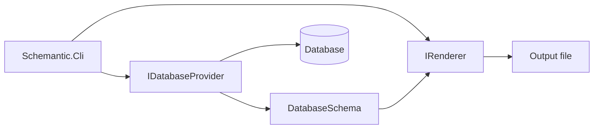

# Schemantic

A multi-database schema documentation tool, with planned support for local LLM-assisted interpretation.

[](#)
[](LICENSE)

## Features

**Current**

- SQL Server metadata extraction
- Markdown, JSON, and HTML output (tables, columns, foreign keys, indexes)
- HTML output with a Mermaid ER diagram, search, and navigation
- Optional LLM table summaries (Ollama / OpenAI-compatible) — skeleton

**Planned**

- Microsoft Access provider
- Column- and view-level LLM commentary; configuration file

## Quick start

**Requirements:** [.NET 8 SDK](https://dotnet.microsoft.com/download/dotnet/8.0)

### Install as a .NET tool

```bash
dotnet tool install -g Schemantic
schemantic --provider sqlite --connection "Data Source=schema.db" --output schema.md
```

### Build from source

```bash
git clone https://github.com/<owner>/schemantic.git
cd schemantic
dotnet build
```

Generate documentation from a SQL Server database:

```bash
dotnet run --project src/Schemantic.Cli -- \
  --connection "Server=localhost;Database=MyDb;Trusted_Connection=True;" \
  --output schema.md
```

Optional flags:

| Flag | Default | Description |
|------|---------|-------------|
| `--provider` | `sqlserver` | Database provider |
| `--format` | `markdown` | Output format (`markdown` \| `json` \| `html`) |
| `--output` | `schema.md` | Output file path |

## Architecture

Schemantic separates database-specific logic from rendering through two abstractions:

- **`IDatabaseProvider`** — connects to a database engine, reads metadata, and maps it to a shared `DatabaseSchema` model.
- **`IRenderer`** — converts `DatabaseSchema` into a target format (Markdown today; HTML later).

The CLI wires a provider and renderer together. Adding a new database means implementing `IDatabaseProvider` in a new project; core, renderers, and CLI stay unchanged.



**Solution layout**

```
schemantic/
├── src/
│   ├── Schemantic.Core/              Shared model and interfaces
│   ├── Schemantic.Providers.SqlServer/
│   ├── Schemantic.Providers.Oracle/
│   ├── Schemantic.Providers.Sqlite/
│   ├── Schemantic.Renderers/         Output renderers
│   └── Schemantic.Cli/               Console entry point
├── tests/
│   └── Schemantic.Tests/             Unit tests
├── samples/                          Sample SQL and databases
├── Schemantic.sln
├── Directory.Build.props
└── global.json
```

| Project | Role |
|---------|------|
| `src/Schemantic.Core` | Shared model and interfaces |
| `src/Schemantic.Providers.SqlServer` | SQL Server provider |
| `src/Schemantic.Providers.Oracle` | Oracle provider |
| `src/Schemantic.Providers.Sqlite` | SQLite provider |
| `src/Schemantic.Renderers` | Output renderers |
| `src/Schemantic.Cli` | Console entry point |
| `tests/Schemantic.Tests` | Unit tests |

## Roadmap

| Version | Scope |
|---------|-------|
| **MVP** | SQL Server → Markdown |
| **v0.2** | Oracle provider |
| **v0.3** | Access provider |
| **v0.4** | HTML output + ER diagrams |
| **v0.5** | Local LLM schema commentary |
| **v1.0** | Stable CLI, documented provider API |

## Contributing

### Test the tool package locally

From the repository root:

```bash
dotnet pack -c Release src/Schemantic.Cli/Schemantic.Cli.csproj
dotnet tool install -g --add-source ./src/Schemantic.Cli/bin/Release Schemantic
```

To add a database provider:

1. Create a project under `src/` (e.g. `src/Schemantic.Providers.Oracle`) referencing `Schemantic.Core`.
2. Implement `IDatabaseProvider` — read engine-specific metadata and populate `DatabaseSchema`.
3. Register the provider in `src/Schemantic.Cli/Program.cs`.

A detailed provider guide will be added later. Pull requests and issue reports are welcome.

## License

[MIT](LICENSE) — Copyright (c) 2026 Oğuz Sarıçam
