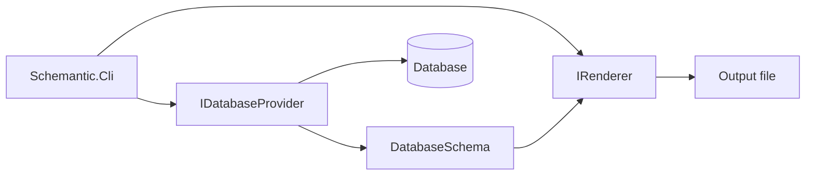

# Schemantic

A multi-database schema documentation tool, with planned support for local LLM-assisted interpretation.

[](#)
[](LICENSE)

## Features

**Current**

- SQL Server metadata extraction
- Markdown, JSON, and HTML output (tables, columns, foreign keys, indexes)
- HTML output with a Mermaid ER diagram, search, and navigation
- Optional LLM table summaries (Ollama / OpenAI-compatible) — skeleton
- Config file with include/exclude schema and table filters (wildcards)
- **REST API (preview)** — runtime read-only REST + Swagger UI from database schema (`Schemantic.Api`; SQLite only today)

**Planned**

- Microsoft Access provider
- Column- and view-level LLM commentary; configuration file

## Quick start

**Requirements:** [.NET 8 SDK](https://dotnet.microsoft.com/download/dotnet/8.0)

### Install as a .NET tool

```bash
dotnet tool install -g Schemantic
schemantic --provider sqlite --connection "Data Source=schema.db" --output schema.md
```

### Build from source

```bash
git clone https://github.com/<owner>/schemantic.git
cd schemantic
dotnet build
```

Generate documentation from a SQL Server database:

```bash
dotnet run --project src/Schemantic.Cli -- \
  --connection "Server=localhost;Database=MyDb;Trusted_Connection=True;" \
  --output schema.md
```

Optional flags:

| Flag | Default | Description |
|------|---------|-------------|
| `--provider` | `sqlserver` | Database provider |
| `--format` | `markdown` | Output format (`markdown` \| `json` \| `html`) |
| `--output` | `schema.md` | Output file path |

## REST API (preview)

**Schemantic.Api** connects to a database, introspects its schema at startup, and exposes a **read-only REST API** with a **Swagger UI**. Endpoints are generated at runtime from `DatabaseSchema` — there is no code generation.

**Status:** preview (v0.6). Data queries work end-to-end with **SQLite** only. Relationship expand (`?expand=`), advanced filters, CRUD, GraphQL, and auth are planned for later milestones.

### Run the API

From the repository root, create a sample SQLite database (once):

```bash
sqlite3 sample.db < samples/seed-sqlite.sql
```

Configure the provider and connection string in `src/Schemantic.Api/appsettings.json` (or `appsettings.Development.json`):

```json
{
  "Schemantic": {
    "Provider": "sqlite",
    "Connection": "Data Source=../../sample.db"
  }
}
```

Paths in `Data Source=...` are resolved relative to the process working directory (typically `src/Schemantic.Api` when using `dotnet run --project`). Prefer an absolute path if unsure.

Start the host:

```bash
dotnet run --project src/Schemantic.Api
```

CLI flags override appsettings (`--provider`, `--connection`, optional `--config`, `--schema` for Oracle):

```bash
dotnet run --project src/Schemantic.Api -- \
  --provider sqlite \
  --connection "Data Source=C:/path/to/sample.db"
```

**Swagger UI:** [http://localhost:5015/swagger](http://localhost:5015/swagger) (default `http` launch profile). OpenAPI document: `/openapi.json`.

### Endpoints

| Method | Path | Description |
|--------|------|-------------|
| `GET` | `/schema` | Introspected `DatabaseSchema` (JSON) |
| `GET` | `/api/{schema}/{table}` | Paginated rows (`?page`, `?pageSize`; default page size 50, max 1000) |
| `GET` | `/api/{schema}/{table}/{id}` | Single row by primary key |

**Example** (using `samples/seed-sqlite.sql` data; SQLite schema name is `main`):

```http
GET /api/main/author?page=1&pageSize=10
```

```json
{
  "page": 1,
  "pageSize": 10,
  "items": [
    { "id": 1, "full_name": "Ahmet Yılmaz", "email": "ahmet@example.com", "bio": "Tarih yazarı" },
    { "id": 2, "full_name": "Zeynep Kaya", "email": null, "bio": null }
  ]
}
```

```http
GET /api/main/author/1
```

```json
{ "id": 1, "full_name": "Ahmet Yılmaz", "email": "ahmet@example.com", "bio": "Tarih yazarı" }
```

## Architecture

Schemantic separates database-specific logic from rendering through two abstractions:

- **`IDatabaseProvider`** — connects to a database engine, reads metadata, and maps it to a shared `DatabaseSchema` model.
- **`IRenderer`** — converts `DatabaseSchema` into a target format (Markdown today; HTML later).

The CLI wires a provider and renderer together. Adding a new database means implementing `IDatabaseProvider` in a new project; core, renderers, and CLI stay unchanged.



**Solution layout**

```
schemantic/
├── src/
│   ├── Schemantic.Core/              Shared model and interfaces
│   ├── Schemantic.Providers.SqlServer/
│   ├── Schemantic.Providers.Oracle/
│   ├── Schemantic.Providers.Sqlite/
│   ├── Schemantic.Renderers/         Output renderers
│   ├── Schemantic.Cli/               Console entry point
│   └── Schemantic.Api/               REST API + Swagger UI (preview)
├── tests/
│   └── Schemantic.Tests/             Unit tests
├── samples/                          Sample SQL and databases
├── Schemantic.sln
├── Directory.Build.props
└── global.json
```

| Project | Role |
|---------|------|
| `src/Schemantic.Core` | Shared model and interfaces |
| `src/Schemantic.Providers.SqlServer` | SQL Server provider |
| `src/Schemantic.Providers.Oracle` | Oracle provider |
| `src/Schemantic.Providers.Sqlite` | SQLite provider |
| `src/Schemantic.Renderers` | Output renderers |
| `src/Schemantic.Cli` | Console entry point |
| `src/Schemantic.Api` | REST API + Swagger UI (preview) |
| `tests/Schemantic.Tests` | Unit tests |

## Roadmap

| Version | Scope |
|---------|-------|
| **MVP** | SQL Server → Markdown |
| **v0.2** | Oracle provider |
| **v0.3** | Access provider |
| **v0.4** | HTML output + ER diagrams |
| **v0.5** | Local LLM schema commentary |
| **v1.0** | Stable CLI, documented provider API |

## Contributing

### Test the tool package locally

From the repository root:

```bash
dotnet pack -c Release src/Schemantic.Cli/Schemantic.Cli.csproj
dotnet tool install -g --add-source ./src/Schemantic.Cli/bin/Release Schemantic
```

To add a database provider:

1. Create a project under `src/` (e.g. `src/Schemantic.Providers.Oracle`) referencing `Schemantic.Core`.
2. Implement `IDatabaseProvider` — read engine-specific metadata and populate `DatabaseSchema`.
3. Register the provider in `src/Schemantic.Cli/Program.cs`.

A detailed provider guide will be added later. Pull requests and issue reports are welcome.

## License

[MIT](LICENSE) — Copyright (c) 2026 Oğuz Sarıçam
